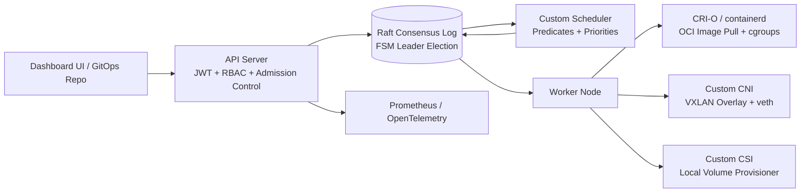

# AuraDeploy: Distributed Orchestrator

**High-Availability Container Orchestration Built on Embedded Raft Consensus and Native OCI Runtimes**


[](./LICENSE)


[](https://github.com/hemu1808/Deploysh/commits/main)
[](https://github.com/hemu1808/Deploysh/issues)
[](https://github.com/hemu1808/Deploysh/pulls)


---

## Table of Contents

- [Overview](#overview)
- [Architecture](#architecture)
- [Key Features](#key-features)
- [Tech Stack](#tech-stack)
- [Project Structure](#project-structure)
- [Getting Started](#getting-started)
- [Roadmap](#roadmap)
- [Use Cases](#use-cases)
- [Contributing](#contributing)
- [License](#license)

## Overview

AuraDeploy is a container orchestrator built purely in Go, designed to abstract away Kubernetes-level complexity while keeping the reliability guarantees that make production orchestration trustworthy. It doubles as a sandbox for studying distributed systems engineering firsthand.

The system is split into two cooperating layers:

- **Subsystem A — Control Plane (Consensus, Scheduling, GitOps).** An embedded HashiCorp Raft store acts as the single source of truth via an internal Finite State Machine — handling leader election, log replication, and FSM snapshots without an external DB like PostgreSQL or etcd. A custom scheduler watches the Raft log for unplaced application replicas and assigns nodes using predicate filtering and priority scoring. A GitOps reconciler layers declarative management on top, diff-checking cluster state against Git-defined specs and healing drift automatically.
- **Subsystem B — Data Plane (Runtime, Networking, Storage).** Worker nodes run containers via a native CRI-O/containerd client — staging OCI images, injecting cgroup limits, and managing network namespaces directly with `netlink`. A custom CNI overlay (VXLAN + deterministic IPAM) connects containers across hosts, and a custom CSI provisioner binds Persistent Volume Claims to local host paths.

## Key Features

- 🗳️ Embedded Raft consensus for HA leader election and FSM replication — no external DB required
- 📦 Native CRI-O/containerd runtime integration with manual namespace and cgroup management
- 🎯 Custom scheduler with predicate filtering and `LeastAllocated` priority scoring
- 🌐 Custom CNI overlay — VXLAN, deterministic IPAM, and dummy-DNS service discovery
- 💾 Custom CSI local volume provisioner with 1:1 PVC-to-host-path binding
- 🔐 JWT auth, RBAC, and admission-control webhooks that strip privileged container specs
- 🔄 GitOps reconciler with automatic drift detection and healing
- 📊 Prometheus + OpenTelemetry observability built into the core routing loop

## Architecture



### Core Components

**1. Raft Consensus Layer (High Availability)**
The single-node backend is augmented by an embedded HashiCorp `raft` distributed key-value store. Master nodes handle leadership elections, log replication, and FSM snapshots; API handlers redirect commands to the active leader, giving a true Active-Passive HA control plane with no external DB dependency.

**2. CRI-O / containerd Integration**
Instead of shelling out to the Docker CLI, AuraDeploy acts as a native Container Runtime Interface client via `containerd/oci` — downloading and staging OCI images, manually mounting network namespaces via `netlink`, injecting cgroup limits, and using underlying snapshotters for layer isolation.

**3. Custom Scheduler**
A Go-routine scheduling loop on the leader node watches the Raft array for application replicas lacking a `nodeID`. **Predicates** filter nodes on hard constraints (`HasSufficientResources`, `VolumeNodeAffinity`); **Priorities** score viable nodes (e.g. `LeastAllocated`) to spread CPU/memory load. Placements are written back to the Raft log for the target worker to claim.

**4. Custom Network Overlay (CNI)**
Worker nodes form a multi-host networking mesh natively on Linux. **IPAM** slices deterministic `/24` subnets from an ephemeral cluster-wide `/16` CIDR. **Linux Bridge & VXLAN** connect nodes via a host bridge (`aura0`) attached to a VXLAN overlay (`vxlan0`). **Network Namespaces** isolate containers via `veth` pairs spliced between host bridge and container namespace. **Service Discovery** runs through an integrated dummy UDP DNS server reacting to FSM placement updates.

**5. Custom CSI (Storage Provisioner)**
A local volume controller reconciliation loop provisions host-paths mapped 1:1 to Persistent Volume Claims; the CRI daemon injects the resolved OCI bind mounts into container specs.

**6. API Security & Admission Control**
JWT bearer-token authentication middleware identifies callers; RBAC maps verified subjects against FSM `Roles`/`RoleBindings` (HTTP verb vs. allowed resource endpoint). Admission-control webhooks intercept deployments to strip privileged containers and reject payloads that attempt root-filesystem access or override `RUN_AS_ROOT` constraints.

**7. GitOps Declarative Reconciler**
Applications can be managed imperatively via the UI/API, or declaratively via the GitOps engine, which parses Kubernetes-style `kind: Application` definitions (`yaml.v3`) and actively diff-checks local cluster state against the remote spec — healing drifted env vars, corrupt images, or invalid replica counts.

**8. Observability Stack**
A Prometheus HTTP exporter exposes custom FSM gauges (e.g. `auradeploy_total_applications`); OpenTelemetry traces are registered into the routing pipeline (`go.opentelemetry.io/otel`); an event recorder pushes structured cluster-mutation history over stdout, mirroring Kubernetes `Events`.

## Tech Stack

| Backend | Cluster / Networking | Storage & Security | Frontend & Observability |
|---|---|---|---|
| Go 1.20+ | HashiCorp Raft (consensus) | Custom CSI (local volume provisioner) | React dashboard |
| containerd / CRI-O (OCI runtime) | Custom CNI (VXLAN, `netlink`, IPAM) | JWT auth + RBAC admission control | Prometheus |
| `yaml.v3` (GitOps parsing) | Dummy UDP DNS (service discovery) | | OpenTelemetry |


## Project Structure

```
.
├── backend/
│   ├── cmd/
│   │   └── server/            # Go entrypoint — Raft node bootstrap
│   ├── raft/                  # Embedded HashiCorp Raft FSM + log store
│   ├── scheduler/              # Predicates + priorities scheduling loop
│   ├── cri/                    # CRI-O/containerd client, OCI image staging
│   ├── cni/                    # VXLAN overlay, IPAM, netlink, service discovery
│   ├── csi/                    # Local volume provisioner
│   ├── api/                    # JWT auth, RBAC, admission control, HTTP handlers
│   ├── gitops/                 # Declarative reconciler + drift detection
│   └── observability/          # Prometheus exporter, OTel tracing
├── src/                         # React dashboard (frontend)
├── go.mod
├── package.json
└── README.md
```


## Roadmap

- [x] Phase 1 — Embedded Raft consensus layer for HA leader election & FSM replication
- [x] Phase 2 — Native CRI-O/containerd integration (OCI image pull, namespaces, cgroups)
- [x] Phase 3 — Custom scheduler (predicates + priorities, `LeastAllocated` scoring)
- [x] Phase 4 — Custom CNI overlay (VXLAN, IPAM, dummy-DNS service discovery)
- [x] Phase 5 — Custom CSI local volume provisioner
- [x] Phase 6 — API security: JWT auth, RBAC, admission-control webhooks
- [x] Phase 7 — GitOps declarative reconciler with drift detection
- [x] Phase 8 — Observability stack (Prometheus, OpenTelemetry, event recorder)
- [ ] Automated test coverage & CI
- [ ] Multi-region / WAN-aware Raft topology
- [ ] Public documentation & architecture write-ups

> *Last three are suggested next steps — swap in whatever's actually next on your list.*

## Use Cases

- **Lightweight production orchestration** — K8s-grade self-healing and scheduling without running etcd or a full control plane
- **Distributed systems learning platform** — a working, inspectable Raft + custom scheduler + custom CNI/CSI stack in a single Go binary
- **Edge / self-hosted deployments** — a single-binary control plane fits resource-constrained or air-gapped environments better than a full Kubernetes install

## Why AuraDeploy?

Kubernetes dominates production orchestration, but its complexity creates
heavy operational overhead for smaller deployments. AuraDeploy exists to
test how far a carefully engineered, single-binary control plane can go —
proving out self-healing, real-time state synchronization via Raft, and
declarative GitOps-driven scaling without pulling in a full Kubernetes
stack.

## Current Status

| Component | Status |
|------------|:------:|
| Raft Consensus Layer | ✅ |
| CRI-O / containerd Integration | ✅ |
| Custom Scheduler | ✅ |
| Custom CNI (VXLAN Overlay) | ✅ |
| Custom CSI (Volume Provisioner) | ✅ |
| API Security (JWT + RBAC + Admission Control) | ✅ |
| GitOps Reconciler | ✅ |
| Observability (Prometheus / OTel) | ✅ |
| React Dashboard | ✅ |
| Unit & Integration Tests | ⬜ |
| CI/CD Pipeline | ⬜ |

## ⚙️ Deployment Reconciliation Flow

```text
             Application Submitted
          (Dashboard UI or GitOps Repo)
                           │
                           ▼
                 API Server (JWT + RBAC)
        ┌─────────────────────────────────────┐
        │ • Authenticate + authorize request   │
        │ • Admission control strips privileged│
        │   container specs                    │
        └─────────────────────────────────────┘
                           │
                           ▼
                 Raft Consensus Log
        ┌─────────────────────────────────────┐
        │ • Leader commits application spec    │
        │ • Replicated to FSM on all nodes      │
        └─────────────────────────────────────┘
                           │
                           ▼
                  Custom Scheduler
        ┌─────────────────────────────────────┐
        │ • Predicates filter eligible nodes    │
        │ • Priorities score + pick best node   │
        │ • Placement written back to Raft log  │
        └─────────────────────────────────────┘
                           │
                           ▼
                Worker Node Claims Spec
        ┌─────────────────────────────────────┐
        │ • CRI-O pulls OCI image, sets cgroups │
        │ • CNI attaches VXLAN overlay network  │
        │ • CSI binds local volume to container │
        └─────────────────────────────────────┘
                           │
                           ▼
               Running + Observed
        ┌─────────────────────────────────────┐
        │ • Prometheus/OTel metrics emitted     │
        │ • GitOps reconciler watches for drift │
        └─────────────────────────────────────┘
```

## Getting Started

### Prerequisites

- Go 1.20+
- Node.js v18+ & npm

### 1. Start the backend (AuraDeploy FSM leader)

```bash
cd backend
$env:RAFT_NODE_ID="node1"
$env:RAFT_BIND_ADDR="127.0.0.1:9000"
$env:PORT="8080"
$env:RAFT_BOOTSTRAP="true"
go run ./cmd/server
```

**Join a worker node (optional)** — in a second terminal:

```bash
cd backend
$env:RAFT_NODE_ID="node2"
$env:RAFT_BIND_ADDR="127.0.0.1:9001"
$env:PORT="8081"
go run ./cmd/server -join 127.0.0.1:8080
```

### 2. Start the frontend (dashboard)

```bash
npm install
npm run dev
```

### 3. Verify the deployment

Open `http://localhost:5173` for the dashboard, or check the leader's cluster state directly:

```bash
curl http://localhost:8080/applications
```

## Contributing

Contributions are welcome. Please open an issue to discuss scope before submitting a large pull request. Bug reports, documentation improvements, and test coverage are especially appreciated at this stage.

## License

*(Not yet specified — add a `LICENSE` file and update this section, e.g. MIT/Apache 2.0.)*

## Author

**Hemanth Kumar Mangalapurapu** — [github.com/hemu1808](https://github.com/hemu1808)
