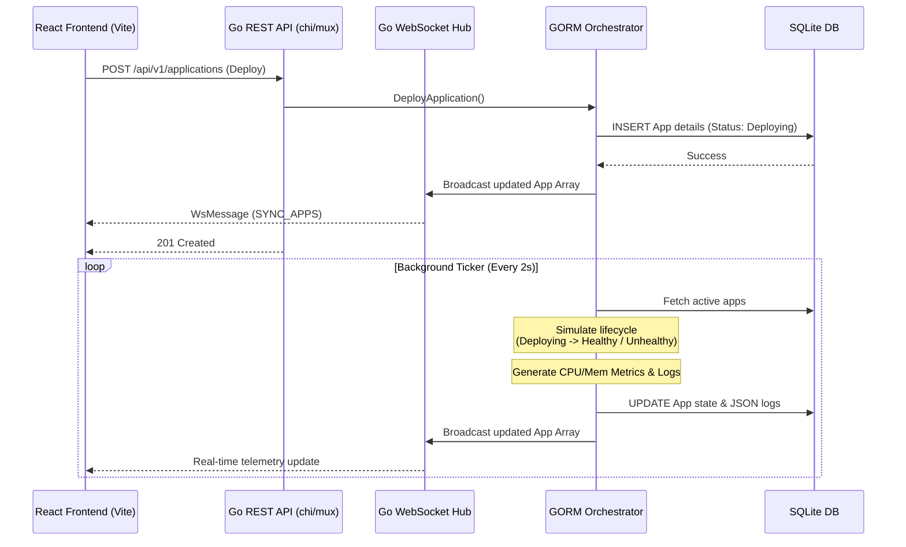

# 🚀 AuraDeploy

AuraDeploy is a lightweight, self-healing container orchestration platform designed to simplify application deployments, scaling, and real-time telemetry monitoring. By abstracting the complexity of heavy orchestrators like Kubernetes, AuraDeploy provides developers with a sleek, real-time dashboard and robust backend control plane.

---

## 🏗️ System Architecture

AuraDeploy employs a decoupled, event-driven architecture utilizing a modern React frontend and a highly concurrent Go backend. 



### Flow Breakdown
1. **Frontend Interactions**: The user performs an action (Deploy, Scale, Remove) via the React dashboard.
2. **REST API**: The Go backend receives the request, parses the payload (including `EnvVars` and `PortMappings`), and routes it to the Orchestrator service.
3. **Database Operations**: The Orchestrator leverages **GORM** to interact with a local **SQLite database**, ensuring that application states, logs, and metrics persist safely across server restarts.
4. **Real-time Telemetry**: A continuous Go routine (`simulationLoop`) acts as the background worker. It monitors the database, updating application status (mocking Docker starts/crashes) and generating CPU/Memory metrics.
5. **WebSocket Hub**: Every time the Orchestrator mutates state, it broadcasts the entire application fleet through a channel to the WebSocket Hub. The hub streams `SYNC_APPS` payloads to all connected React clients.
6. **UI Hydration**: The React frontend uses `@tanstack/react-query` to ingest the WebSocket streams, patching the local cache instantly and triggering seamless DOM repaints without HTTP polling.

---

## 💻 System Design

### 1. Backend Core (`go`)

*   **Robust WebSockets**: Handled via `gorilla/websocket`. The implementation includes production-level Ping/Pong heartbeats and Read/Write deadlines. If a React client abruptly drops the connection, the Go server catches the timeout and gracefully closes the Goroutine, preventing memory leaks and unhandled TCP panic crashes.
*   **Data Persistence (GORM)**: The platform uses `gorm.io/driver/sqlite`. Because complex arrays (like `[]Metric` and `[]EnvVar`) aren't natively supported by standard SQLite, the domain models implement custom `Valuer` and `Scanner` interfaces to automatically marshal/unmarshal these slices into SQLite `TEXT` columns as JSON.
*   **Structured Logging**: Utilizes Go 1.21's `log/slog` standard library package to output clean, structured, and parseable JSON logs detailing API method hits, client connections, and orchestrator actions.

### 2. Frontend Core (`React` + `Vite`)

*   **State Synchronization**: All API fetches execute through native `axios`. However, the app relies on the `wsService` hook heavily. Instead of writing complex reducers, incoming WebSocket broadcasts are fed directly into the React Query client (`queryClient.setQueryData`), ensuring the UI is precisely matched to the backend database instantly.
*   **Glassmorphism UI**: The aesthetic ditches primitive box-shadows for deep, multi-layered Glassmorphism. The UI utilizes strict Tailwind classes: `backdrop-blur-md`, `bg-white/5`, and structural gradient borders to achieve a frosted, premium SaaS feel. 
*   **Context API Notifications**: All user events (Scale, Deploy, Error) trigger a custom `useToast` Context Hook. This spawns auto-dismissing layout-animated toast notifications layered above the DOM tree via a fixed transparent container.

---

## 🚀 Running Locally

AuraDeploy requires two terminals to run simultaneously: one for the Go Orchestrator backend, and one for the React Vite frontend.

### Prerequisites
- [Go](https://go.dev/dl/) (1.21+)
- [Node.js](https://nodejs.org/) (18+)

### 1. Start the Go Backend
The backend initializes the SQLite database automatically on boot.

```bash
cd backend
go mod tidy
go run ./cmd/server/main.go
```
*The API will start on `http://localhost:8080/api/v1` and the WS hub on `ws://localhost:8080/ws`.*

### 2. Start the React Frontend

```bash
# In the root project directory:
npm install
npm run dev
```
*The web dashboard will be available at `http://localhost:5173`. You can also run `npm run build` to compile the production-ready static assets.*

---

## 🛣️ Future Roadmap

This V1 implementation perfectly simulates a robust control plane. The natural next steps involve tying the Orchestrator service directly into a real container runtime.

1.  **Docker SDK Integration**: Swap the random `simulationLoop` with real calls to the Docker Daemon API (via `docker/docker/client`) to actually spin up containers from requested images.
2.  **Authentication**: Add JWT-based login wrapping the REST API and WebSocket connection handshakes.
3.  **Reverse Proxy**: Implement dynamic routing (like Traefik) so that deployed applications are assignable to real subdomains (e.g., `app-user-service.auradeploy.local`). 
